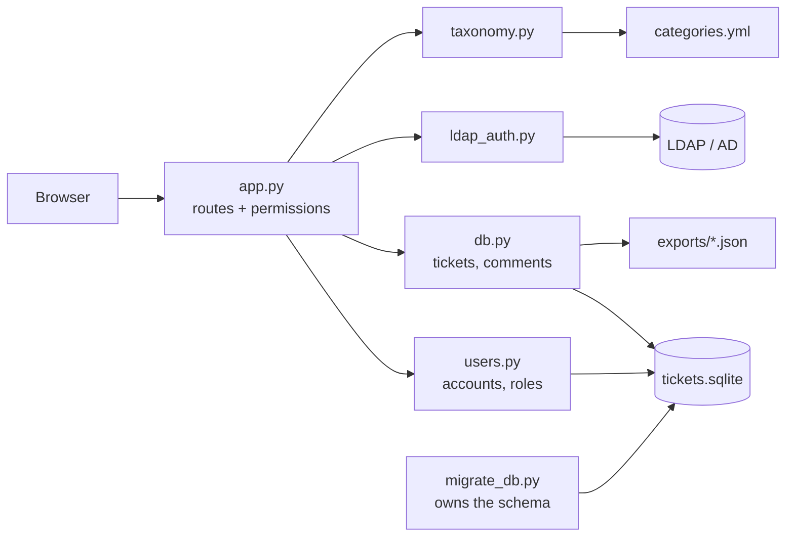

# Architecture

**Contents:** [Shape of the app](#shape-of-the-app) ·
[Modules](#modules) ·
[Request flow](#request-flow) ·
[Startup sequence](#startup-sequence) ·
[Serving HTTP and HTTPS](#serving-http-and-https) ·
[Templates and styling](#templates-and-styling) ·
[Lists, search and sorting](#lists-search-and-sorting) ·
[Time handling](#time-handling) ·
[Extension points](#extension-points)

## Shape of the app

A single Flask process, server-rendered pages, one SQLite file. There is no
API layer, no background worker and no client-side framework — every page is a
form post and a redirect. That is a deliberate ceiling: the app is meant to be
readable end to end by whoever inherits it.

## Modules

| Module | Responsibility | Does **not** |
| --- | --- | --- |
| `app.py` | Routes, form parsing, permission checks, flash messages, dev server | Touch SQL directly |
| `db.py` | Ticket and comment rows, dedup signature, eval export | Create or alter tables |
| `users.py` | Account rows, roles, statuses, password hashing, bootstrap admin | Create or alter tables |
| `ldap_auth.py` | One function: bind a username/password against the directory | Store anything |
| `migrate_db.py` | Every `CREATE`, `ALTER`, `INDEX`, as numbered steps | Read application data |
| `taxonomy.py` | Load and validate `categories.yml`, fall back to built-ins | Know about Flask |
| `version.py` | `APP_NAME`, `APP_VERSION` | Anything else |

The split matters most for the schema: because `migrate_db.py` is the only
place DDL exists, "what does this database look like, and how did it get that
way" has exactly one answer. See [database.md](database.md).

## Request flow

Every request passes through the same three gates before a view runs:

1. **`@app.before_request` → `_csrf_protect()`** — any `POST` must carry a
   `csrf_token` field matching the one in the session, or it is rejected with
   400. Templates emit it via `{{ csrf_token() }}`.
2. **`@login_required` / `@admin_required`** — no session user redirects to
   `/login` with a `next` parameter; a non-admin hitting an admin route gets
   403. `_safe_next()` refuses absolute URLs so `next` can't be used as an open
   redirect.
3. **Per-object permission checks inside the view** — being logged in is not
   the same as being allowed to act on *this* ticket. `ticket_detail()`
   computes `is_owner`, `is_admin`, `locked`, `awaiting` and derives
   `can_comment`, `can_verify`, `can_reopen` from them; the template hides what
   the view would refuse anyway, and the view still refuses it.

The context processor `inject_auth_context()` supplies templates with the
current user, `csrf_token`, `app_name`, `app_version`, the label lookups
(`toolkit_label`, `category_label`, `resolution_label`, `source_label`,
`scope_label`, `operation_label`) and the `local_time` formatter, so templates
never import application modules themselves.

## Startup sequence

1. `taxonomy.load()` reads `categories.yml` and the module-level constants
   (`TOOLKITS`, `CATEGORIES`, `RESOLUTIONS`, …) are derived from it. A missing
   file falls back to built-in defaults; a malformed file raises and stops the
   app, because silently ignoring a typo would leave people filing tickets
   against a vocabulary nobody intended.
2. `load_ldap_config()` and `load_server_config()` read `config.ini`.
   configparser lowercases keys, so the LDAP keys are upper-cased back.
3. `bootstrap()` runs `migrate_db.migrate()` and then
   `users.ensure_bootstrap_admin()`, so a fresh clone is usable immediately and
   an existing database is brought up to date on every start.

## Serving HTTP and HTTPS

`config.ini` decides what the built-in server listens on:

- `[SERVER] http_enabled` / `http_port` — the plain listener (default `5000`).
- `[SERVER] bind` — the interface both listeners use (default `0.0.0.0`).
- `[HTTPS] enabled`, `port`, `ssl_cert`, `ssl_key` — the TLS listener.

If HTTPS is enabled but the certificate or key is missing, startup fails with
a message naming the files. Falling back to plaintext there would silently put
login passwords on the wire.

When both are enabled, one process serves both: the HTTPS listener runs in the
main thread under the reloader, and the plain listener runs in a daemon thread
created with `werkzeug.serving.make_server`. Two details are load-bearing:

- The thread is only started when `WERKZEUG_RUN_MAIN == "true"`, i.e. inside
  the reloader's child process. Starting it in the parent too would leave two
  processes fighting over the port on every reload.
- It uses `make_server` rather than a second `app.run()`. Inside the reloader
  child, `app.run()` expects to inherit the reloader's socket through
  `WERKZEUG_SERVER_FD`; a second call finds no such variable and dies with a
  `KeyError` in a thread whose traceback nobody reads.

This is still the development server. For a real deployment, put a reverse
proxy in front and terminate TLS there — see
[../INSTALL.md](../INSTALL.md#behind-a-reverse-proxy).

## Templates and styling

All templates extend `base.html`, which owns the navbar, flash messages, the
footer and the `container_class` block (`wide` for tables, `narrow` for forms).

| Template | Used by |
| --- | --- |
| `base.html` | everything |
| `login.html` | `/login` |
| `new_ticket.html` | `/tickets/new` **and** `/tickets/<id>/edit` |
| `tickets.html` | `/tickets`, `/tickets/mine`, `/admin` |
| `ticket_detail.html` | `/tickets/<id>` |
| `users.html` | `/admin/users` |
| `change_password.html` | `/account/password` |

`new_ticket.html` doubles as the edit form: `_render_ticket_form()` passes
`action_url`, `submit_label`, `heading`, `form_subtitle` and an optional
`ticket`, so the two paths cannot drift apart. Likewise `_render_list()` backs
all three list pages, differing only in title, subtitle and the submitter
filter.

Bootstrap comes from a CDN for its grid only; every colour, pill, table width
and spacing rule lives in `static/style.css`, so losing the CDN degrades the
layout instead of destroying it. Table columns use a fixed layout with
percentage widths and media queries drop the least important columns at
narrower viewports, which is what keeps the list pages free of horizontal
scroll.

## Lists, search and sorting

`_list_params()` parses and validates the query string once — `q`, `status`,
`toolkit`, `sort`, `dir`, `page`, `page_size` — and `db.search_tickets()`
applies it. Two allowlists keep this safe:

- `db.SEARCH_COLUMNS` — the columns a free-text search looks through. The id is
  matched as text, so searching `83` finds ticket #83.
- `db.SORT_COLUMNS` — the only sortable keys. Anything else falls back to the
  default, so the `sort` parameter can never reach SQL unchecked.

Severity and status are ranked rather than sorted alphabetically (`high, low,
normal` would be useless), using a `CASE` expression built from
`STATUS_ORDER` and the configured severity order.

## Time handling

Timestamps are written UTC as `YYYY-MM-DD HH:MM:SS`. `_local_time()` renders a
`<time data-utc="…">` element with a short fallback, and a small script in
`base.html` rewrites it to the reader's own timezone. So the database stays
unambiguous and nobody has to do arithmetic to read a ticket.

## Extension points

- **Dedup** — `db.compute_signature()` is one function. Swap it for a call into
  rad-agent-toolkit's `scripts/feedback_collector.py` if you want a single
  dedup engine across both systems.
- **Storage** — `db.py` is plain SQL against a connection from `get_conn()`.
  Pointing it at Postgres is a rewrite of that one module.
- **Roles from LDAP groups** — `TICKETING_ADMINS` only seeds the role on first
  sight. A group-membership check in `ldap_auth.py` plus a `users.set_role()`
  call on each login scales better; see
  [authentication.md](authentication.md#roles).
- **Notifications** — nothing emails anybody yet. The cheapest version is
  `smtplib` to `submitter_email` when a ticket enters
  `ready_for_verification`.
