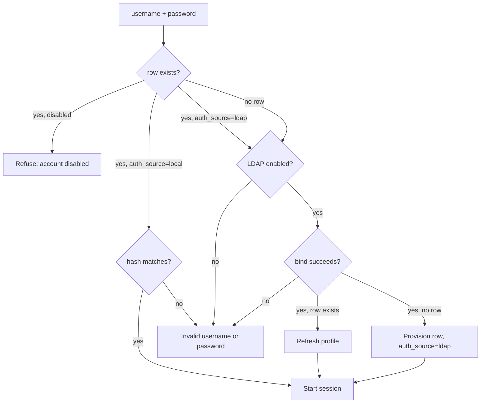

# Authentication and accounts

**Contents:** [Two backends, one table](#two-backends-one-table) ·
[The login flow](#the-login-flow) ·
[Local accounts](#local-accounts) ·
[The bootstrap admin](#the-bootstrap-admin) ·
[LDAP accounts](#ldap-accounts) ·
[Enabling LDAP](#enabling-ldap) ·
[Roles](#roles) ·
[Managing users](#managing-users) ·
[Sessions](#sessions) ·
[CSRF](#csrf) ·
[Hardening notes](#hardening-notes) ·
[Troubleshooting](#troubleshooting)

## Two backends, one table

There is a single `users` table, and every row carries an `auth_source`:

| `auth_source` | `password_hash` | Verified by |
| --- | --- | --- |
| `local` | Werkzeug hash | `users.verify_password()`, in-process |
| `ldap` | empty string | A live bind against the directory |

An LDAP row exists only to carry role, status and profile — no password is ever
stored for it. That's what lets the app run three ways without a switch: local
accounts only (no directory at all), LDAP only, or both at once, with the login
flow deciding per user. Contractors and service accounts get local logins while
employees keep using their normal company credentials.

## The login flow



Two properties worth keeping if you change this:

- **One generic failure message** on every path, so the form never reveals
  whether a username exists or which backend it authenticates against. The
  disabled-account message is the deliberate exception — it tells a real user
  to go talk to an administrator instead of retyping their password.
- **A disabled account is refused before either backend is tried**, so
  disabling somebody in the app blocks them even if the directory still
  accepts their password.

After login the user lands on `/tickets/new`, or on the `next` page they were
originally after. `_safe_next()` rejects absolute URLs, so `next` cannot be
turned into an open redirect.

## Local accounts

Created at `/admin/users` by an admin, or by the bootstrap step. Passwords are
hashed with `werkzeug.security.generate_password_hash` and must be at least 8
characters. Users change their own at `/account/password`, which requires the
current password; an LDAP user who goes there is told their password belongs to
the company directory.

Usernames are unique and compared case-insensitively (`COLLATE NOCASE`), so
`Alice` and `alice` are the same account.

## The bootstrap admin

An app nobody can log into is useless, so the first start creates one local
admin — but only if the `users` table is empty. If the password was generated,
it is printed **once** to the log:

```
WARNING:app:Created first local admin 'admin' with generated password: <shown once>
```

Choose your own instead by setting `TICKETING_BOOTSTRAP_ADMIN` and
`TICKETING_BOOTSTRAP_PASSWORD` before the first run. Either way, change it at
`/account/password` afterwards.

Lost it? From the repo root with the venv active:

```powershell
.\.venv\Scripts\python.exe -c "import users; users.set_password(users.get_user('admin')['id'], 'new-password')"
```

## LDAP accounts

`ldap_auth.ldap_authenticate()` returns `{'dn', 'email', 'display_name'}` on
success and `None` on every failure. It tries two strategies, the same pair the
PKI repo uses:

1. **Direct bind with guessed DNs.** For each of `LDAP_PEOPLE_DN` and
   `LDAP_BASE_DN`, it tries `cn=`, `uid=` and `sAMAccountName=` with both the
   full username and the part before any `@`. A bind failure moves on to the
   next candidate; a connection-level error is logged.
2. **Admin bind and search.** If no direct bind worked and `LDAP_ADMIN_DN`,
   `LDAP_ADMIN_PASSWORD` and `LDAP_BASE_DN` are all set, it binds as the
   service account, searches for `uid` / `cn` / `mail` / `sAMAccountName`
   matching the username, then re-binds as the DN it found to verify the
   password. This is the path Active Directory usually needs.

Connections use a 5-second connect and receive timeout, so an unreachable
directory fails the login rather than hanging the worker indefinitely.

The first successful bind for an unknown username **provisions** a row with
`auth_source = 'ldap'`. On later logins the row's email and display name are
refreshed from the directory, so ticket attribution follows renames.

## Enabling LDAP

Copy `config.ini.example` to `config.ini`, fill in the `[LDAP]` section and set
`enabled = true`. The keys are listed in
[configuration.md](configuration.md#ldap).

LDAP is treated as off unless it is explicitly enabled **and** `LDAP_HOST` is
set — a half-filled config disables it rather than producing mysterious login
failures. When it's off, the login page doesn't advertise it.

`config.ini` holds a service-account password, so it is git-ignored; on a
server, `chmod 600` it and own it by root.

## Roles

Two roles: `user` and `admin`. Admins get `/admin` (the triage queue),
`/admin/users`, and the triage actions on a ticket.

`TICKETING_ADMINS` is a comma-separated list of usernames that get the admin
role **the first time each is seen** — at local creation or LDAP
auto-provision. It is a seed, not an ongoing source of truth: after that,
roles live in the database and are changed at `/admin/users`.

If your directory has a group like `cn=rad-toolkit-admins,…`, a
group-membership check in `ldap_auth.py` plus a `users.set_role()` call on each
login scales better than an allowlist.

Three things the app refuses, to avoid locking everybody out:

- Demoting, disabling or deleting the **last active admin**.
- An admin changing their **own** role or account status — including deleting
  themselves.
- Setting any password shorter than 8 characters.

## Managing users

`/admin/users` covers the lot: create a local account, reset a password,
promote or demote, disable or enable, delete. LDAP rows appear alongside local
ones and can be given roles and statuses the same way — only their password is
somebody else's problem.

## Sessions

Flask's signed cookie session, holding the user id, username, display name and
role. It is signed with `TICKETING_SECRET_KEY`, so:

- **Set it in production.** The default `change-me-in-config` is not a secret.
- **Keep it stable.** Changing it invalidates every session — everybody is
  logged out on the next request.
- Keep it out of shell history and out of git; an environment file with mode
  `600`, or a secrets manager, is enough.

Roles are read from the session, so a role change takes effect on the user's
next login rather than instantly.

## CSRF

Every `POST` must carry a `csrf_token` field matching the token in the session,
checked in `@app.before_request` before any view runs. The token is
`secrets.token_urlsafe(32)`, minted once per session, and templates emit it
with `{{ csrf_token() }}`. A form without it gets a 400 — which is the usual
cause if you add a form and it stops working immediately.

## Hardening notes

- **Passwords cross the wire at login.** Serve HTTPS — either terminate TLS in
  the app (`[HTTPS]` in `config.ini`) or put nginx in front. Do not serve plain
  HTTP beyond localhost.
- **There is no rate limiting.** A determined attacker can spray the login
  form. Put it behind something that counts (nginx `limit_req`, or fail2ban on
  the `Failed local login for:` / `Failed LDAP login for:` log lines).
- **There is no account lockout**, deliberately — with LDAP in the mix, lockout
  here would be a second, inconsistent copy of a policy the directory already
  has.
- **Failed and successful logins are logged** with usernames but never with
  passwords.

## Troubleshooting

| Symptom | Cause |
| --- | --- |
| Login always fails, no LDAP errors in the log | `enabled = false` or no `LDAP_HOST`. Only local accounts work in that state. |
| Login hangs a few seconds, then fails | `enabled = true` but the host is unreachable |
| Direct binds all fail, admin bind not attempted | `LDAP_ADMIN_DN` / `LDAP_ADMIN_PASSWORD` / `LDAP_BASE_DN` incomplete |
| "This account is disabled" | The row's `status` is `disabled`; re-enable at `/admin/users` |
| Everybody logged out after a restart | `TICKETING_SECRET_KEY` changed between runs |
| A form silently returns 400 | Missing `{{ csrf_token() }}` in that form |
