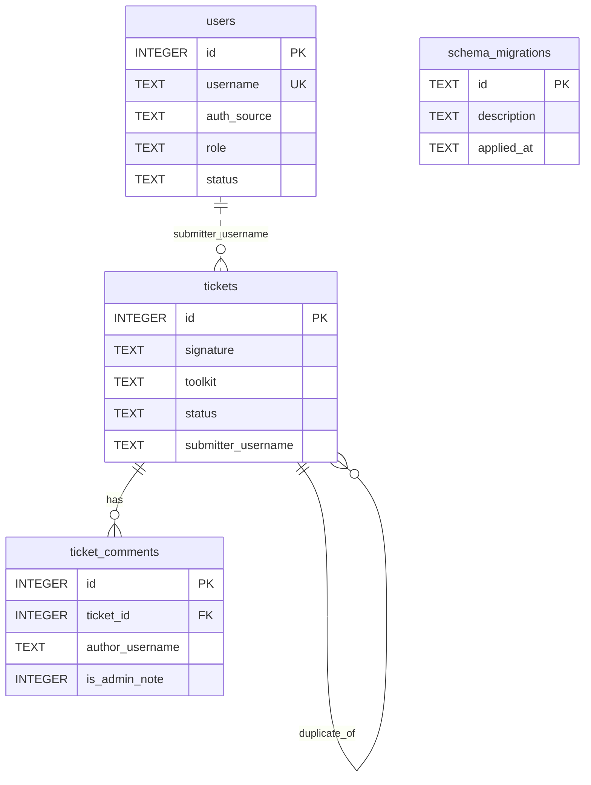

# Database

**Contents:** [Where it lives](#where-it-lives) ·
[Who owns the schema](#who-owns-the-schema) ·
[Running migrations](#running-migrations) ·
[Tables](#tables) ·
[Ticket columns](#ticket-columns) ·
[Multi-select storage](#multi-select-storage) ·
[The dedup signature](#the-dedup-signature) ·
[Migration history](#migration-history) ·
[Adding a migration](#adding-a-migration) ·
[Backups and inspection](#backups-and-inspection)

## Where it lives

One SQLite file, `tickets.sqlite` in the repo root by default. Set
`TICKETING_DB` to move it. Both the app and the migration CLI resolve the path
through `migrate_db.db_path()`, so they can never disagree about which file
they mean.

No ORM. `db.py` and `users.py` issue plain SQL against a connection with
`sqlite3.Row` as the row factory, and hand dictionaries back to the views.

## Who owns the schema

`migrate_db.py`, and nothing else. Every `CREATE TABLE`, `ALTER TABLE` and
`CREATE INDEX` in the project is a numbered step in its `MIGRATIONS` list.
`db.py` and `users.py` read and write rows only.

Each step is:

- **Recorded** in a `schema_migrations` table, so re-running is a no-op and you
  can see what a given database has had done to it.
- **Individually idempotent** — it uses `IF NOT EXISTS`, or checks
  `PRAGMA table_info` before adding a column. A database built before
  `schema_migrations` existed is therefore adopted rather than broken.
- **Committed on its own**, so a failure part-way leaves the earlier steps
  applied and recorded instead of rolling back the lot.

## Running migrations

```powershell
.\.venv\Scripts\python.exe migrate_db.py            # bring the database up to date
.\.venv\Scripts\python.exe migrate_db.py --status   # list applied / pending steps
```

`app.bootstrap()` runs migrations at startup too, so a fresh clone just works,
and the systemd unit runs them as `ExecStartPre` so a failed migration stops
the service instead of letting it serve against a half-built database.

## Tables



`ticket_comments` declares a foreign key to `tickets`, but SQLite doesn't
enforce foreign keys unless `PRAGMA foreign_keys = ON`, so
`db.delete_ticket()` deletes the comments and clears dangling `duplicate_of`
references itself.

Indexes: `idx_tickets_signature`, `idx_tickets_status`, `idx_tickets_toolkit`,
`idx_comments_ticket`, `idx_users_auth_source`.

### `users`

| Column | Notes |
| --- | --- |
| `id` | Primary key |
| `username` | Unique, `COLLATE NOCASE` |
| `password_hash` | Werkzeug hash for local rows; empty string for LDAP rows |
| `role` | `user` or `admin` |
| `email`, `display_name` | Profile, refreshed from LDAP on each login |
| `status` | `active` or `disabled` |
| `auth_source` | `local` or `ldap` |
| `created_at`, `last_login` | UTC timestamps |

### `ticket_comments`

| Column | Notes |
| --- | --- |
| `ticket_id` | The ticket it belongs to |
| `author_username`, `author_display` | Who wrote it |
| `body` | The text |
| `is_admin_note` | `1` when written by an admin who isn't the submitter |
| `created_at` | UTC timestamp |

## Ticket columns

| Column | Purpose |
| --- | --- |
| `id` | Primary key, and the ticket number people quote |
| `signature` | Dedup hash — see [below](#the-dedup-signature) |
| `toolkit` | Which AI toolkit the ticket is about |
| `categories` | What went wrong; comma-joined ids |
| `rad_families` | Device families covered; comma-joined |
| `knowledge_scope` | `rad`, `market`, or both; comma-joined |
| `knowledge_sources` | Reference material the answer should have come from |
| `operations` | What the agent was doing |
| `title` | Given, or derived from the first substantial line of the prompt |
| `description` | Free text |
| `expected_behavior`, `actual_behavior` | Optional advanced fields |
| `prompt` | The exact prompt, kept separate so it can be re-run |
| `transcript` | The pasted chat |
| `suggestion` | What the submitter thinks the answer should have been |
| `toolkit_version` | `rad agent show system versions` output as reported |
| `severity` | From the configured severities; default `normal` |
| `status` | See [workflow.md](workflow.md#statuses); default `new` |
| `duplicate_of` | The earlier ticket this collapsed onto |
| `resolution`, `resolution_note` | The admin's outcome |
| `fixed_in_versions` | Versions of the build carrying the fix |
| `fixed_answer` | The corrected answer, and the `expected_answer` of an exported eval case |
| `resolved_by`, `resolved_at` | Who handed it back, and when |
| `verified_by`, `verified_at` | Who confirmed it, and when |
| `promoted_at` | Last export to an eval case; orthogonal to status |
| `submitter_username`, `submitter_email` | Who filed it |
| `created_at`, `updated_at` | UTC timestamps |

## Multi-select storage

`categories`, `rad_families`, `knowledge_sources`, `knowledge_scope` and
`operations` are comma-joined id strings in a single `TEXT` column, not join
tables. Nothing queries across them — they are filtered in Python and rendered
as pills — so a join table would be structure without a use. Ids are validated
against the loaded taxonomy before they are written, so the column can only
ever hold known values (or values from a taxonomy that has since changed).

Read them back with a split-and-filter, as `db.export_as_eval_case()` does:

```python
[c for c in (ticket["categories"] or "").split(",") if c]
```

## The dedup signature

`db.compute_signature(toolkit, categories, prompt, title, description)`:

1. Join the fields with `|`, lowercase them.
2. Replace hex literals with `<hex>` and bare numbers with `<n>`.
3. Collapse whitespace.
4. SHA-256, truncated to 16 hex characters.

On submission, if an open ticket already carries the signature, the new one is
stored as `duplicate` and linked through `duplicate_of`. Editing a ticket
recomputes it.

The prompt is the strongest signal — two people asking the same thing and
hitting the same wall is exactly the case worth collapsing. The toolkit scopes
it, because the same question of two toolkits is two problems. The facets are
excluded on purpose, so one bug doesn't become two tickets because somebody
ticked an extra box.

This mirrors, at a much smaller scale, the Tier-1 signature dedup in
rad-agent-toolkit's `scripts/feedback_collector.py`; swap this function for a
call into that if you want one dedup engine instead of two.

## Migration history

| Id | What it does |
| --- | --- |
| `0001_tickets` | The `tickets` table, plus the signature and status indexes |
| `0002_users` | Local + LDAP user accounts, and the `auth_source` index |
| `0003_ticket_comments` | Follow-up comments |
| `0004_ticket_subcategory` | Adds `subcategory` (later removed by 0010) |
| `0005_ticket_prompt` | Splits the submitter's prompt out of the pasted chat |
| `0006_ticket_resolution` | Close outcome, note and fix versions |
| `0007_ticket_fixed_answer` | The corrected answer from the fixed build |
| `0008_verification_workflow` | Renames `closed_by`/`closed_at` to `resolved_by`/`resolved_at`, adds `verified_by`/`verified_at`/`promoted_at`, maps `closed` → `verified`, `not_fixed` → `known_issue`, `promoted` → `triaged` plus a `promoted_at` stamp |
| `0009_ticket_facets` | `knowledge_sources` and `operations` |
| `0010_multi_categories` | Table rebuild: multi-select `categories`, `subcategory` dropped, old values mapped onto `slow_result` / `wrong_result` |
| `0011_ticket_toolkit` | `toolkit`, backfilled to `rad-agent-toolkit`, plus its index |
| `0012_families_scope_suggestion` | Multi-select `rad_families`, `knowledge_scope`, `suggestion` |

0008 and 0010 are the interesting ones: they are where the workflow stopped
being "admin closes a ticket" and where a ticket stopped having exactly one
category. Both migrate the existing rows rather than dropping them.

## Adding a migration

1. Write `_00NN_short_name(cur)` in `migrate_db.py`, using the `_add_column`,
   `_rename_column`, `_columns` and `_table_exists` helpers so the step is
   idempotent.
2. Append `("00NN_short_name", "one-line description", _00NN_short_name)` to
   `MIGRATIONS`.
3. Never edit a migration that has shipped — add another one.
4. Test all three paths: a fresh database, an upgrade from the previous
   version, and re-running against an already-migrated database.

SQLite can't drop or retype a column, so a change of that kind is a table
rebuild — `CREATE TABLE tickets_new`, `INSERT … SELECT`, `DROP`, `RENAME`,
recreate the indexes. `_0010_multi_categories` is the worked example.

## Backups and inspection

```bash
sqlite3 tickets.sqlite ".backup '/var/backups/tickets.sqlite'"
sqlite3 tickets.sqlite ".schema tickets"
sqlite3 tickets.sqlite "SELECT id, description, applied_at FROM schema_migrations;"
```

Use `.backup` rather than copying the file while the app is running — it takes
a consistent snapshot instead of a possibly torn one. `seed_demo.py` fills an
empty database with sample tickets if you want something to look at.
