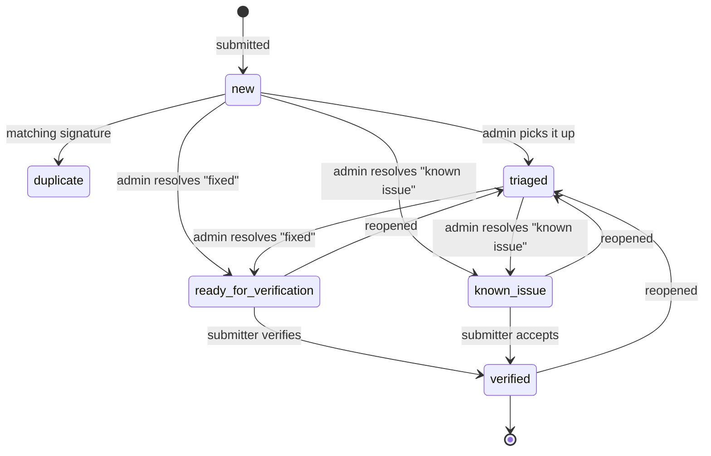

# User guide

RAD AI Ticketing Center — what every screen does, and how to use it.

**Contents:** [What this app is for](#what-this-app-is-for) ·
[Signing in](#signing-in) ·
[Getting around](#getting-around) ·
[Filing a ticket](#filing-a-ticket) ·
[Finding tickets](#finding-tickets) ·
[The ticket page](#the-ticket-page) ·
[Verifying and reopening](#verifying-and-reopening) ·
[For admins](#for-admins) ·
[Managing users](#managing-users) ·
[Statuses at a glance](#statuses-at-a-glance) ·
[Who can do what](#who-can-do-what) ·
[Questions people ask](#questions-people-ask)

## What this app is for

You asked a RAD AI toolkit something and the answer was wrong, slow, or made
up. This is where you report it, in a form structured enough that someone can
act on it.

The loop it exists to run:

1. **You file a ticket** with the exact prompt you used and the chat that came
   back.
2. **An admin triages it**, fixes the underlying toolkit, and hands the ticket
   back with the corrected answer and the build that carries the fix.
3. **You verify** — you, not the admin. A "fixed" nobody confirmed is a claim,
   not a fix.
4. **The confirmed ticket becomes a regression test**, so the same bad answer
   can't come back unnoticed.

That is the whole point of the extra fields: a ticket with a prompt and an
expected answer can be turned into a test case. A ticket that says "the bot is
wrong" cannot.

## Signing in

Go to the URL your administrator gave you and sign in at `/login`.

Two kinds of account, and you don't have to care which you have — the login
form is the same:

- **Company directory (LDAP)** — your normal work username and password. Your
  account is created automatically the first time you sign in successfully.
- **Local account** — created for you by an admin, with a password only this
  app knows.

To change a local password, use the account menu → **Change password**
(`/account/password`). Directory passwords are not changeable here; use your
company's normal process.

If login fails repeatedly, the message is deliberately vague ("Invalid username
or password") — it never reveals whether an account exists. Ask an admin to
check the logs.

## Getting around

| Page | Path | What it's for |
| --- | --- | --- |
| New ticket | `/tickets/new` | File a report. This is the landing page after login |
| My tickets | `/tickets/mine` | Everything you submitted, and what state it's in |
| All tickets | `/tickets` | Everything anyone reported |
| Ticket | `/tickets/<id>` | One ticket: the report, the outcome, the conversation |
| Triage queue | `/admin` | Admins only: every ticket with the admin actions |
| Users | `/admin/users` | Admins only: accounts and roles |
| Change password | `/account/password` | Local accounts only |

Everyone who can log in can read every ticket. That's intentional: seeing what
is already reported is what stops the same issue being filed five times.

## Filing a ticket

`/tickets/new`. The form is ordered so the useful part comes first.

**1. Which toolkit** — preselected to the default, change it if you were using
another. Everything downstream follows from this: who triages it, which repo
the eventual test case belongs in, and which tickets yours could duplicate.

**2. What went wrong** — tick as many as apply. A slow answer that also needed
three retries and still came back wrong is *one* ticket with three boxes
ticked, not three tickets.

**3. Your prompt** — the exact text you sent, on its own. This is the single
most valuable field: an admin re-runs it against the fixed build and pastes
back what it says now. Without it, the ticket can't become a test.

**4. The pasted chat** — the whole conversation, warts and all. Long is fine.

**5. Facets** — knowledge scope, knowledge sources, operations, RAD families.
All optional, all multi-select. They help route the ticket; they don't affect
duplicate detection, so don't agonise over them.

**Advanced details** is collapsed on purpose — title, description, expected vs.
actual behaviour, severity, toolkit version, suggestion. Fill in what you know.
A report that arrives beats a perfect report nobody writes.

Rules the form enforces:

- You must supply **at least one** of: the prompt, the pasted chat, or a
  description. An empty ticket is rejected rather than stored.
- **No title? One is derived** from the first substantial line of your prompt,
  then the chat, then the description.
- Every selected option must exist in the current vocabulary, so a stale
  bookmarked form can't inject unknown values.

### Duplicates

On submission the app hashes a normalised form of your toolkit, categories,
prompt, title and description — numbers, hex values and whitespace flattened —
so near-identical reports collapse together. If an open ticket already matches,
yours is filed as **duplicate** and linked to the original.

This is not a rejection. Follow the link, read what's already known, and add a
follow-up there if you have something to add.

The same question asked of two different toolkits is two problems, not a
duplicate.

## Finding tickets

Both list pages (`/tickets`, `/tickets/mine`) and the admin queue share the
same controls:

- **Search** — free text across the ticket content.
- **Status filter** — narrow to `new`, `triaged`, awaiting verification, and so
  on.
- **Toolkit filter** — one toolkit at a time.
- **Sort** — click a column heading; click again to flip direction. Severity
  sorts by real severity order, not alphabetically.
- **Page size** — 25 by default.

The filters live in the URL, so a filtered view is a link you can paste to a
colleague.

## The ticket page

`/tickets/<id>` shows the report as filed, the facets, the current status, and
the outcome once there is one: the resolution, the note, the build that carries
the fix, and the corrected answer.

The submitter's original prompt has a **copy button** next to it — that's the
intended way to re-run it.

**Follow-ups** are the conversation at the bottom. Anyone logged in can read
them. Adding is narrower:

- The **submitter** can add follow-ups until the ticket is verified.
- **Admins** can always add. A comment from an admin who isn't the submitter is
  flagged as an admin note.

**Editing** (submitter or admin) reopens the same form used to file it. Only
the content and facets can change — status, resolution and ownership cannot, so
nobody can promote their own ticket to "fixed" through the edit form. Editing
recomputes the duplicate signature.

**Deleting** (submitter or admin) removes the ticket and its comments, and
unlinks any ticket that pointed at it as a duplicate.

## Verifying and reopening

When an admin hands a ticket back it sits in **ready for verification** (they
believe it's fixed) or **known issue** (real, but not being fixed now). It
waits for *you*, the submitter.

- **Verify** — you agree. The ticket becomes `verified`, which is the end
  state, and stops taking follow-ups from you.
- **Reopen** — it isn't actually fixed. The ticket goes back to `triaged` and
  the entire outcome is cleared: resolution, note, fixed-in versions, corrected
  answer, resolver, verifier. A stale "fixed in 3.2" can't linger on a ticket
  that turned out not to be fixed.

Admins **cannot** verify a ticket, only the submitter can. An admin closing
their own triage item is exactly the rubber-stamping this workflow exists to
prevent. Admins can reopen, including a verified ticket.

## For admins

The triage queue at `/admin` lists every ticket with the admin actions on each.
From there or from a ticket page:

**Mark triaged** — a plain acknowledgement: someone has picked it up.

**Resolve** — choose an outcome and hand the ticket back. The form refuses
incomplete work:

| Outcome | What you must supply |
| --- | --- |
| Fixed | The `rad agent show versions` output of the build carrying the fix, **and** the corrected answer from re-running the submitter's prompt on that build |
| Known issue | A note explaining the decision |

(The exact list of outcomes comes from `categories.yml`, so your install may
have more.)

The recommended rhythm: copy the submitter's prompt with the copy button, run
it against the fixed build, paste what it says now into **corrected answer**.
That pair — prompt and expected answer — is what makes the ticket exportable as
a test.

Resolving records who resolved it and when, and clears any previous
verification. It never closes the ticket; the submitter decides that.

**Promote to eval case** — exports the ticket as a JSON stub into `exports/`,
shaped for the toolkit's `tests/evals/cases/`. Copy it into the toolkit repo.
Promotion can happen at any point and does **not** change the ticket's status.

## Managing users

`/admin/users`, admins only.

- **Create a local account** — username, password (8 characters minimum), role,
  and optionally email and display name. Directory users don't need this; they
  are created on first successful login.
- **Change a role** between user and admin.
- **Disable / enable** an account. A disabled user is refused at login with a
  clear message.
- **Reset a password** (local accounts).
- **Delete** an account.

Two guard rails you can't override from the UI: you cannot change your own role
or status, and you cannot demote, disable or delete the **last active admin**.
Promote someone else first.

Usernames listed in the `TICKETING_ADMINS` setting are made admins the first
time they are seen, so the first directory login of a named person arrives with
the right role.

## Statuses at a glance

| Status | Meaning | Set by |
| --- | --- | --- |
| `new` | Filed, nobody has looked yet | Submission |
| `duplicate` | Same signature as an earlier open ticket | Automatic on submission |
| `triaged` | An admin has picked it up | Admin |
| `ready_for_verification` | Fixed; waiting on the submitter to confirm | Admin, outcome "fixed" |
| `known_issue` | Real, but not being fixed for now | Admin, outcome "known issue" |
| `verified` | The submitter confirmed. End state | Submitter |

## Who can do what

| Action | Anyone logged in | Submitter | Admin |
| --- | --- | --- | --- |
| Read any ticket | yes | yes | yes |
| File a ticket | yes | — | yes |
| Add a follow-up | no | until verified | always |
| Edit / delete a ticket | no | yes | yes |
| Mark triaged | no | no | yes |
| Resolve (hand back) | no | no | yes |
| Verify (close) | no | yes | **no** |
| Reopen | no | yes | yes |
| Promote to eval case | no | no | yes |
| Manage users | no | no | yes |

These are enforced server-side, not just by hiding buttons.

## Questions people ask

**My ticket was marked duplicate. Was it ignored?**
No. It's linked to the original, which someone is already working. Add anything
new as a follow-up there.

**I don't have the original prompt any more.**
File it anyway with the chat and a description. It just can't become a test
case until someone can reproduce it.

**Can I file on behalf of someone else?**
You can, but you become the submitter — and the submitter is who has to verify
the fix. Better to have them file it.

**An admin marked it fixed but it isn't.**
Reopen it. That clears the outcome entirely and puts it back in the queue.

**Why can't I comment any more?**
The ticket is verified, which is the end state. Ask an admin to reopen it if
something new turned up.

**Why does the form keep rejecting my submission?**
It needs at least one of prompt, pasted chat or description, and every selected
option must be a current one. The red message names the problem.

**Where did my exported eval case go?**
`exports/` in the install directory, named after the ticket. The flash message
after promoting names the exact path.

---

Running or installing the app is in [../INSTALL.md](../INSTALL.md). The
workflow rationale is in [workflow.md](workflow.md); the vocabulary you see in
the form is configured in [configuration.md](configuration.md).
