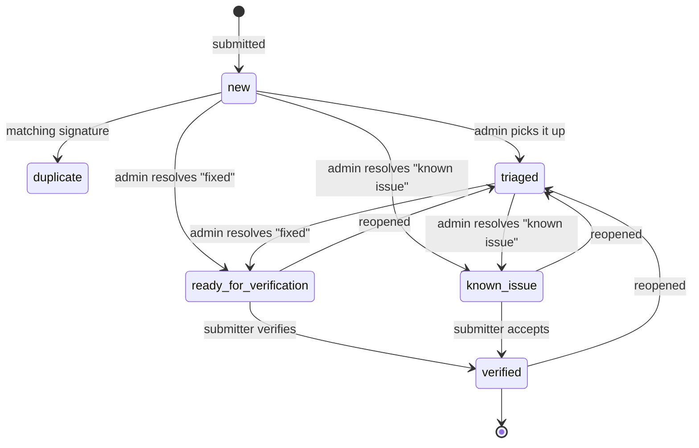

# Ticket workflow

**Contents:** [The idea](#the-idea) ·
[Statuses](#statuses) ·
[The lifecycle](#the-lifecycle) ·
[Filing a ticket](#filing-a-ticket) ·
[Duplicates](#duplicates) ·
[Triage and hand-back](#triage-and-hand-back) ·
[Verification](#verification) ·
[Reopening](#reopening) ·
[Follow-ups](#follow-ups) ·
[Editing and deleting](#editing-and-deleting) ·
[Who can do what](#who-can-do-what)

## The idea

Admins never close a ticket. They **resolve** it — stating an outcome, the
build that carries the fix, and the corrected answer — and hand it back to the
person who filed it. Only that person can close it, by **verifying**.

That single rule is why the workflow has the shape it does. An admin closing
their own triage item is exactly the rubber-stamping this flow exists to
prevent, and a "fixed" that the reporter never confirmed is a claim, not a fix.

## Statuses

| Status | Meaning | Set by |
| --- | --- | --- |
| `new` | Filed, nobody has looked yet | Submission |
| `triaged` | An admin has picked it up | Admin, *Mark triaged* |
| `ready_for_verification` | Fixed; waiting on the submitter to confirm | Admin, resolution `fixed` |
| `known_issue` | Real, but not being fixed for now | Admin, resolution `known_issue` |
| `verified` | The submitter confirmed the outcome. End state | Submitter, *Verify* |
| `duplicate` | Same failure signature as an earlier open ticket | Automatic on submission |

Two groupings in `db.py` drive the permissions:

- `RESOLVED_STATUSES = ("ready_for_verification", "known_issue")` — waiting on
  the submitter.
- `LOCKED_STATUSES = ("verified",)` — settled; it takes no further input from
  its owner.

The statuses themselves are code, not configuration — they're the workflow.
What *is* configurable is which resolutions map onto them, in
`categories.yml`; see [configuration.md](configuration.md#resolutions).

## The lifecycle

Promotion to an eval case is deliberately *not* on this diagram: it can happen
at any point and does not change the status. See
[eval-cases.md](eval-cases.md).

## Filing a ticket

`/tickets/new`. The form asks, in order:

1. **Which toolkit** — preselected from the `default: true` entry in
   `categories.yml`. This is first because everything downstream follows from
   it: who triages, which repo the eval case belongs to, and the dedup scope.
2. **What went wrong** — multi-select. A slow answer that also needed three
   retries and still came back wrong is one ticket with three boxes ticked.
3. **Your prompt** — the exact prompt, on its own. This is the field that makes
   the round trip work: the admin re-runs it against the fixed build and pastes
   what it says now, which turns the ticket into a `prompt` /
   `expected_answer` pair.
4. **The pasted chat** — the whole conversation.
5. **Facets** — knowledge scope, knowledge sources, operations, RAD families.
   All multi-select, all optional.

Everything else (title, description, expected vs. actual, severity, toolkit
version, suggestion) sits in a collapsed *Advanced details* section, because a
report that arrives at all beats a perfect one nobody fills in.

At least one of the prompt, the pasted chat or a description must be present —
a submission with none of them is rejected rather than stored as an empty
ticket. If the title is blank, `_derive_title()` takes the first substantial
line of the prompt, then the chat, then the description.

Every submitted id is checked against the loaded vocabulary. An unknown
category, family, source, operation or severity is rejected, not stored.

## Duplicates

On submission `db.compute_signature()` hashes a normalised form of the toolkit,
the categories, the prompt, the title and the description — with numbers, hex
values and whitespace flattened, so near-identical reports collapse together.
If an open ticket already carries that signature, the new one is stored with
status `duplicate` and `duplicate_of` pointing at it.

Two design notes:

- The **toolkit scopes the signature**: the same question asked of two
  different toolkits is two problems, not a duplicate.
- The **facets are excluded** from it: two people hitting one bug shouldn't
  become two tickets because one of them ticked an extra box.

Editing a ticket recomputes its signature.

## Triage and hand-back

From `/admin` or the ticket page, an admin can:

- **Mark triaged** — a plain acknowledgement, status `triaged`.
- **Resolve** — pick an outcome from the configured resolutions. The form
  refuses to submit incomplete work:

  | Outcome flag | What it demands |
  | --- | --- |
  | `requires_version` | The `rad agent show system versions` output of the build carrying the fix |
  | `requires_answer` | The corrected answer, from re-running the submitter's prompt on that build |
  | `requires_note` | A written explanation |

  With the shipped taxonomy, `fixed` demands the version and the answer;
  `known_issue` demands a note.

- **Promote to eval case** — export the ticket as JSON; see
  [eval-cases.md](eval-cases.md).

Resolving records `resolution`, `resolution_note`, `fixed_in_versions`,
`fixed_answer`, `resolved_by` and `resolved_at`, and clears any previous
verification.

The ticket page shows the submitter's original prompt with a copy button, which
is the intended way to do the re-run: copy the prompt, run it against the fixed
build, paste the answer back into the resolve form.

## Verification

The ticket sits in `ready_for_verification` or `known_issue` until its
submitter opens it and either:

- **Verifies** — status `verified`, with `verified_by` and `verified_at`. This
  is the end state, and the ticket stops accepting follow-ups from its owner.
- **Reopens** — back to `triaged`.

Admins cannot verify. `can_verify = is_owner and awaiting`, and the view
enforces it with a 403, not just by hiding the button.

## Reopening

Either the submitter or an admin can reopen a resolved or verified ticket. It
returns to `triaged` and the whole outcome — resolution, note, fixed versions,
fixed answer, resolver and verifier — is cleared, so a stale "fixed in 3.2"
cannot linger on a ticket that turned out not to be fixed.

## Follow-ups

Any logged-in user can read every ticket; seeing what's already reported is
what stops the same issue being filed five times. Adding to one is narrower:

- The **submitter** can add follow-ups until the ticket is `verified`.
- **Admins** can always add, including to reopen the conversation on a settled
  ticket. A comment from an admin who isn't the submitter is flagged as an
  admin note.

## Editing and deleting

The submitter (and admins) can edit a ticket through the same form used to
create it. Only `db.EDITABLE_FIELDS` can change — the content fields and the
facets. Status, resolution and ownership are deliberately not editable, so no
one can promote their own ticket to "fixed" through the edit form.

Deleting removes the ticket, its comments, and clears `duplicate_of` on any
ticket that pointed at it — SQLite doesn't enforce foreign keys by default, so
`db.delete_ticket()` does that cleanup itself.

## Who can do what

| Action | Anyone logged in | Submitter | Admin |
| --- | --- | --- | --- |
| Read any ticket | yes | yes | yes |
| File a ticket | yes | — | yes |
| Add a follow-up | no | until verified | always |
| Edit / delete a ticket | no | yes | yes |
| Mark triaged | no | no | yes |
| Resolve (hand back) | no | no | yes |
| Verify (close) | no | yes | **no** |
| Reopen | no | yes | yes |
| Promote to eval case | no | no | yes |
| Manage users | no | no | yes |
